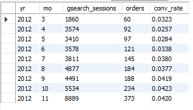
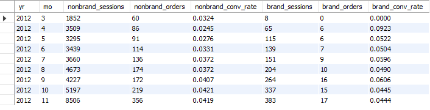
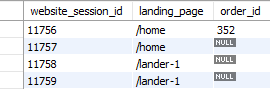
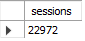
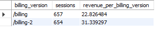

# Maven Analytics - Advanced MySQL Project

<p align="left">
    
    
</p>

#### Table of Contents
[Business Case](#business-case) | 
[Data Description](#data-description) | 
[Approach](#approach) | 
[Results](#results) | 
[In-Depth Analysis](#in-depth-analysis) | 
[Credits](#credits)

<!-- Insert Banner photo of dashboard -->

### Business Case
Maven Fuzzy Factory is an online retailer that launched 8 months ago with the launch of their Mr. Fuzzy product. I am an e-commerce database analyst that works with the Head of Marketing and the Website Manager to optimize marketing channels and website conversion rates.

Cindy Sharp, the CEO, has to present performance metrics to the board in an upcoming meeting. She has sent an email requesting my help to collect data to tell the story of the company’s growth over the first eight months to present to the board. 
<br>
<br>

>Good morning,
I need some help preparing a presentation for the board
meeting next week.
The board would like to have a better understanding of our
growth story over our first 8 months. This will also be a
good excuse to show off our analytical capabilities a bit.
-Cindy

<br>


### Data Description

The Maven Fuzzy Factory Database contains six related tables about Maven Fuzzy Factory e-commerce data. For this assignment we will be utilizing the tables that contain website activity data, including website_sessions, website_pageviews, and orders. 

<br>
<br>

**The website_sessions table**

```
SELECT * FROM website_sessions;
SELECT COUNT(*) FROM website_sessions;
```


<br>
<br>

**The website_pageviews table**

```
SELECT * FROM website_pageviews;
SELECT COUNT(*) FROM website_pageviews;
```


<br>
<br>

**The orders table**

```
SELECT * FROM orders;
SELECT COUNT(*) FROM orders;
```


<br>
<br>

### Approach

### Results

<details>
  <summary><h3>In-Depth Analysis</h3></summary>
  

  

**1.   Gsearch seems to be the biggest driver of our business. Could you pull monthly trends for Gsearch sessions
and orders so that we can showcase the growth there?**
<br>
<br>

```
SELECT
    YEAR(ws.created_at) AS yr,
    MONTH(ws.created_at) AS mo,
    COUNT(DISTINCT ws.website_session_id) AS gsearch_sessions,
    COUNT(DISTINCT o.order_id) AS orders,
    COUNT(DISTINCT o.order_id)/COUNT(DISTINCT ws.website_session_id) AS conv_rate
FROM website_sessions AS ws
    LEFT JOIN orders AS o
        ON ws.website_session_id = o.website_session_id
WHERE
    ws.utm_source = 'gsearch'
    AND ws.created_at < '2012-11-27'
GROUP BY 
    yr,
    mo
;
```

			     
**2. Next, it would be great to see a similar monthly trend for Gsearch, but this time splitting out nonbrand and brand campaigns separately.
I am wondering if brand is picking up at all. If so, this is a good story to tell.**
<br>
<br>

```
SELECT
    YEAR(ws.created_at) AS yr,
    MONTH(ws.created_at) AS mo,
    COUNT(DISTINCT CASE WHEN utm_campaign = 'nonbrand' THEN ws.website_session_id ELSE NULL END) AS nonbrand_sessions,
    COUNT(DISTINCT CASE WHEN utm_campaign = 'nonbrand' THEN o.order_id ELSE NULL END) AS nonbrand_orders,
    COUNT(DISTINCT CASE WHEN utm_campaign = 'nonbrand' THEN o.order_id ELSE NULL END)/
        COUNT(DISTINCT CASE WHEN utm_campaign = 'nonbrand' THEN ws.website_session_id ELSE NULL END) AS nonbrand_conv_rate,
    COUNT(DISTINCT CASE WHEN utm_campaign = 'brand' THEN ws.website_session_id ELSE NULL END) AS brand_sessions,
    COUNT(DISTINCT CASE WHEN utm_campaign = 'brand' THEN o.order_id ELSE NULL END) AS brand_orders,
    COUNT(DISTINCT CASE WHEN utm_campaign = 'brand' THEN o.order_id ELSE NULL END)/
        COUNT(DISTINCT CASE WHEN utm_campaign = 'brand' THEN ws.website_session_id ELSE NULL END) AS brand_conv_rate
FROM website_sessions AS ws
    LEFT JOIN orders AS o
        ON ws.website_session_id = o.website_session_id
WHERE
    ws.utm_source = 'gsearch'
    AND ws.created_at < '2012-11-27'
GROUP BY 
    yr,
    mo
;
```
	

**3. While we're on Gsearch, could you dive into nonbrand, and pull monthly sessions and orders split by device type?
I want to flex out analytical muscles a little and show the board we really know our traffic sources.**
<br>
<br>

```
SELECT
    YEAR(ws.created_at) AS yr,
    MONTH(ws.created_at) AS mo,
    COUNT(DISTINCT CASE WHEN device_type = 'desktop' THEN ws.website_session_id ELSE NULL END) AS desktop_sessions,
    COUNT(DISTINCT CASE WHEN device_type = 'desktop' THEN o.order_id ELSE NULL END) AS desktop_orders,
    COUNT(DISTINCT CASE WHEN device_type = 'desktop' THEN o.order_id ELSE NULL END)/
        COUNT(DISTINCT CASE WHEN device_type = 'desktop' THEN ws.website_session_id ELSE NULL END) AS desktop_conv_rate,
    COUNT(DISTINCT CASE WHEN device_type = 'mobile' THEN ws.website_session_id ELSE NULL END) AS mobile_sessions,
    COUNT(DISTINCT CASE WHEN device_type = 'mobile' THEN o.order_id ELSE NULL END) AS mobile_orders,
    COUNT(DISTINCT CASE WHEN device_type = 'mobile' THEN o.order_id ELSE NULL END)/
        COUNT(DISTINCT CASE WHEN device_type = 'mobile' THEN ws.website_session_id ELSE NULL END) AS mobile_conv_rate
FROM website_sessions AS ws
    LEFT JOIN orders AS o
        ON ws.website_session_id = o.website_session_id
WHERE
    ws.utm_source = 'gsearch'
    AND ws.created_at < '2012-11-27'
GROUP BY 
    yr,
    mo
;
```
	

**4. I'm worried that one of our more pessimistic board members may be concerned about the large % of traffic
from Gsearch. Can you pull monthly trends for Gsearch, alongside monthly trends for each of our other channels?**
<br>
<br>
	
```
SELECT
    YEAR(created_at) AS yr,
    MONTH(created_at) AS mo,
    COUNT(DISTINCT CASE WHEN utm_source = 'gsearch' THEN website_session_id ELSE NULL END) AS gsearch_sessions,
    COUNT(DISTINCT CASE WHEN utm_source = 'bsearch' THEN website_session_id ELSE NULL END) AS bsearch_sessions,
    COUNT(DISTINCT CASE WHEN utm_source IS NULL AND http_referer IS NOT NULL THEN website_session_id ELSE NULL END) AS organic_search_sessions,
    COUNT(DISTINCT CASE WHEN utm_source IS NULL AND http_referer IS NULL THEN website_session_id ELSE NULL END) AS direct_type_sessions
FROM website_sessions
WHERE
    created_at < '2012-11-27'
GROUP BY 
    yr,
    mo
;
```
	

**5. I'd like to tell the story of website performance improvements over the course of the first 8 months.
Could you pull session to order conversion rates, by month?**
<br>
<br>

```
SELECT
    YEAR(ws.created_at) AS yr,
    MONTH(ws.created_at) AS mo,
    COUNT(DISTINCT ws.website_session_id) AS sessions,
    COUNT(DISTINCT o.order_id) AS orders,
    COUNT(DISTINCT o.order_id)/COUNT(DISTINCT ws.website_session_id) AS conv_rate
FROM website_sessions AS ws
    LEFT JOIN orders AS o
        ON ws.website_session_id = o.website_session_id
WHERE
    ws.created_at < '2012-11-27'
GROUP BY 
    yr,
    mo
;
```
	

**6. For the Gsearch lander test, please estimate the revenue that test earned us.**
<br>
<br>

This is a multiple step problem. First we need to determine the minimum website pageview id for /lander-1 test page.

```
SELECT
    MIN(website_pageview_id) as min_pv_id
FROM website_pageviews
WHERE
    pageview_url = '/lander-1'
;
```
	


<br>
<br>

Now we create a temp table for first_pageviews using min_pv_id 23504 as the minimum pageview.

```	
DROP TEMPORARY TABLE IF EXISTS first_pageviews;
CREATE TEMPORARY TABLE first_pageviews
SELECT
    wp.website_session_id,
    MIN(wp.website_pageview_id) as min_pv_id
FROM website_pageviews AS wp
    INNER JOIN website_sessions AS ws
        ON wp.website_session_id = ws.website_session_id
        AND ws.created_at < '2012-07-28'
        AND wp.website_pageview_id > 23504
        AND ws.utm_source = 'gsearch'
        AND ws.utm_campaign = 'nonbrand'
GROUP BY
    wp.website_session_id
;
```
	

<br>
<br>

Now we will get the lander url (either /home or /lander-1) for each first pageview per website session in a temp table.
```	
CREATE TEMPORARY TABLE landing_pages
SELECT
    fp.website_session_id,
    wp.pageview_url AS landing_page
FROM first_pageviews AS fp
    LEFT JOIN website_pageviews AS wp
        ON fp.website_session_id = wp.website_session_id
WHERE
    wp.pageview_url IN ('/home','/lander-1')
;
```
	

<br>
<br>

Create a temp table for each landing page linked with orders if any, else no order is null.
	
```
CREATE TEMPORARY TABLE landing_page_w_orders
SELECT
    landing_pages.website_session_id,
    landing_pages.landing_page,
    orders.order_id
FROM landing_pages
    LEFT JOIN orders
        ON landing_pages.website_session_id = orders.website_session_id
;
```

<br>
<br>

Find the difference between the conversion rates between landing pages.

```	
SELECT
    landing_page,
    COUNT(DISTINCT website_session_id) AS sessions,
    COUNT(DISTINCT order_id) AS orders,
    COUNT(DISTINCT order_id)/COUNT(DISTINCT website_session_id) AS conv_rate
FROM landing_page_w_orders
GROUP BY
    landing_page
;
```
	

The results of 0.0406 - 0.0318 = 0.0088. There is a 0.0088 increase in the conversion rate with the '/lander-1' compared to the '/home' landing page.

Next, we will find the last pageview for Gsearch nonbrand where the traffic was sent to '/home' landing page.
	
```
SELECT
    MAX(ws.website_session_id) AS last_home_pageview,
    MAX(ws.created_at) AS last_date
FROM website_sessions AS ws
    LEFT JOIN website_pageviews AS wp
        ON ws.website_session_id = wp.website_session_id
WHERE
    ws.created_at < '2012-11-27'
    AND utm_source = 'gsearch'
    AND utm_campaign = 'nonbrand'
    AND pageview_url = '/home'
;
```
		       

The last '/home' website session id was 17145. Now we will count sessions since last session '/home' was used.
<br>
<br>

```
SELECT
    COUNT(website_session_id) AS sessions
FROM website_sessions
WHERE
    created_at < '2012-11-27'
    AND utm_source = 'gsearch'
    AND utm_campaign = 'nonbrand'
    AND website_session_id > 17145
;
```
	

22,972 sessions since '/home' landing page was last used. With an 0.0088 increase in the conversion rate that equates to approximately 202 additional orders
since '/home' replacement on '2012-07-29'.
<br>
<br>

7. For the landing page test you analyzed previously, it would be great to show a full conversions funnel
from each of the two orders. You can use the same time period you analyzed last time (Jun 19-Jul 28).
<br>
<br>
	
This query will add a flag = 1 for the page viewed

```
SELECT
    ws.website_session_id,
    wp.pageview_url,
    wp.created_at,
    CASE WHEN pageview_url = '/home' THEN 1 ELSE 0 END AS home_page,
    CASE WHEN pageview_url = '/lander-1' THEN 1 ELSE 0 END AS lander1_page,
    CASE WHEN pageview_url = '/products' THEN 1 ELSE 0 END AS products_page,
    CASE WHEN pageview_url = '/the-original-mr-fuzzy' THEN 1 ELSE 0 END AS mrfuzzy_page,
    CASE WHEN pageview_url = '/cart' THEN 1 ELSE 0 END AS cart_page,
    CASE WHEN pageview_url = '/shipping' THEN 1 ELSE 0 END AS shipping_page,
    CASE WHEN pageview_url = '/billing' THEN 1 ELSE 0 END AS billing_page,
    CASE WHEN pageview_url = '/thank-you-for-your-order' THEN 1 ELSE 0 END AS thankyou_page
FROM website_sessions AS ws
    LEFT JOIN website_pageviews AS wp
        ON ws.website_session_id = wp.website_session_id
WHERE
    ws.created_at > '2012-06-19'
    AND ws.created_at < '2012-07-28'
    AND utm_source = 'gsearch'
    AND utm_campaign = 'nonbrand'
ORDER BY
    ws.website_session_id,
    wp.pageview_url
;
```
			   

<br>
<br>
	
Using the above query as a subquery in the following query will give us the pages viewed
at the website session level
	
```			   
CREATE TEMPORARY TABLE session_level_funnels
SELECT
    website_session_id,
    MAX(home_page) AS home_page_start,
    MAX(lander1_page) AS lander1_page_start,
    MAX(products_page) AS products_made_it,
    MAX(mrfuzzy_page) AS mrfuzzy_made_it,
    MAX(cart_page) AS cart_made_it,
    MAX(shipping_page) AS shipping_made_it,
    MAX(billing_page) AS billing_made_it,
    MAX(thankyou_page) AS thankyou_made_it
FROM (
    SELECT
        ws.website_session_id,
        wp.pageview_url,
        wp.created_at,
        CASE WHEN pageview_url = '/home' THEN 1 ELSE 0 END AS home_page,
        CASE WHEN pageview_url = '/lander-1' THEN 1 ELSE 0 END AS lander1_page,
        CASE WHEN pageview_url = '/products' THEN 1 ELSE 0 END AS products_page,
        CASE WHEN pageview_url = '/the-original-mr-fuzzy' THEN 1 ELSE 0 END AS mrfuzzy_page,
        CASE WHEN pageview_url = '/cart' THEN 1 ELSE 0 END AS cart_page,
        CASE WHEN pageview_url = '/shipping' THEN 1 ELSE 0 END AS shipping_page,
        CASE WHEN pageview_url = '/billing' THEN 1 ELSE 0 END AS billing_page,
        CASE WHEN pageview_url = '/thank-you-for-your-order' THEN 1 ELSE 0 END AS thankyou_page
    FROM website_sessions AS ws
        LEFT JOIN website_pageviews AS wp
	        ON ws.website_session_id = wp.website_session_id
    WHERE
        ws.created_at > '2012-06-19'
        AND ws.created_at < '2012-07-28'
        AND utm_source = 'gsearch'
        AND utm_campaign = 'nonbrand'
    ORDER BY
        ws.website_session_id,
        wp.pageview_url
) AS pageview_level
GROUP BY
    website_session_id
;
```
			       

<br>
<br>

Determine the sessions per funnel segment for each landing page
	
```			   
SELECT
    CASE
        WHEN home_page_start = 1 THEN '/home'
        WHEN lander1_page_start = 1 THEN '/lander-1'
        ELSE 'oops - check the code'
    END AS landing_page,
    COUNT(DISTINCT website_session_id) AS sessions,
    COUNT(DISTINCT CASE WHEN products_made_it = 1 THEN website_session_id ELSE NULL END) AS to_products,
    COUNT(DISTINCT CASE WHEN mrfuzzy_made_it = 1 THEN website_session_id ELSE NULL END) AS to_mrfuzzy,
    COUNT(DISTINCT CASE WHEN cart_made_it = 1 THEN website_session_id ELSE NULL END) AS to_cart,
    COUNT(DISTINCT CASE WHEN shipping_made_it = 1 THEN website_session_id ELSE NULL END) AS to_shipping,
    COUNT(DISTINCT CASE WHEN billing_made_it = 1 THEN website_session_id ELSE NULL END) AS to_billing,
    COUNT(DISTINCT CASE WHEN thankyou_made_it = 1 THEN website_session_id ELSE NULL END) AS to_thankyou
FROM session_level_funnels
GROUP BY
    landing_page
;
```
	

<br>
<br>

Determine the clickthrough rate per funnel segment for each landing page
	
```			   
SELECT
    CASE
        WHEN home_page_start = 1 THEN '/home'
        WHEN lander1_page_start = 1 THEN '/lander-1'
        ELSE 'oops - check the code'
    END AS landing_page,
    COUNT(DISTINCT website_session_id) AS sessions,
    COUNT(DISTINCT CASE WHEN products_made_it = 1 THEN website_session_id ELSE NULL END)/
        COUNT(DISTINCT website_session_id) AS lander_click_rate,
    COUNT(DISTINCT CASE WHEN mrfuzzy_made_it = 1 THEN website_session_id ELSE NULL END)/
        COUNT(DISTINCT CASE WHEN products_made_it = 1 THEN website_session_id ELSE NULL END) AS products_click_rate,
    COUNT(DISTINCT CASE WHEN cart_made_it = 1 THEN website_session_id ELSE NULL END)/
        COUNT(DISTINCT CASE WHEN mrfuzzy_made_it = 1 THEN website_session_id ELSE NULL END) AS mrfuzzy_click_rate,
    COUNT(DISTINCT CASE WHEN shipping_made_it = 1 THEN website_session_id ELSE NULL END)/
        COUNT(DISTINCT CASE WHEN cart_made_it = 1 THEN website_session_id ELSE NULL END) AS cart_click_rate,
    COUNT(DISTINCT CASE WHEN billing_made_it = 1 THEN website_session_id ELSE NULL END)/
        COUNT(DISTINCT CASE WHEN shipping_made_it = 1 THEN website_session_id ELSE NULL END) AS shipping_click_rate,
    COUNT(DISTINCT CASE WHEN thankyou_made_it = 1 THEN website_session_id ELSE NULL END)/
        COUNT(DISTINCT CASE WHEN billing_made_it = 1 THEN website_session_id ELSE NULL END) AS billing_click_rate
FROM session_level_funnels
GROUP BY
    landing_page
;
```
	


**8. I'd love for you to quantify the impact of our billing test, as well. Please analyze the lift
generated from the test (SEP 10 - NOV 10), in terms of revenue per billing page session, and then pull
the number of billing page sessions for the past month to understand monthly impact.**
<br>
<br>

```
SELECT
    billing_version,
    COUNT(DISTINCT website_session_id) AS sessions,
    SUM(price_usd)/COUNT(DISTINCT website_session_id) AS revenue_per_billing_version
FROM (
    SELECT
        wp.website_session_id,
        wp.pageview_url AS billing_version,
        o.order_id,
        o.price_usd
    FROM website_pageviews AS wp
        LEFT JOIN orders AS o
            ON wp.website_session_id = o.website_session_id
    WHERE
        wp.created_at > '2012-09-10'
        AND wp.created_at < '2012-11-10'
        AND wp.pageview_url IN ('/billing', '/billing-2')
) AS pageview_w_order_info
GROUP BY
    billing_version
;
```

/billing    = $22.83 per billing page seen
/billing-2  = $31.34 per billing page seen
Increase of    $8.51 per billing page seen
<br>
<br>

Next determine how many session in the past month
```
SELECT
    COUNT(website_session_id) AS sessions
FROM website_pageviews
WHERE
    pageview_url IN ('/billing','/billing-2')
    AND created_at > '2012-10-27'
    AND created_at < '2012-11-27'
;
```
		      

1,193 sessions in the past month
Increase of $8.51 per billing page seen
Approximate increase of $10,152 over the past month 
  </details>
  
 ### Credits
Maven Fuzzy Factory Database and images provided by [Maven Analytics](http://www.mavenanalytics.io) as part of Advanced MySQL Data Analysis course.
